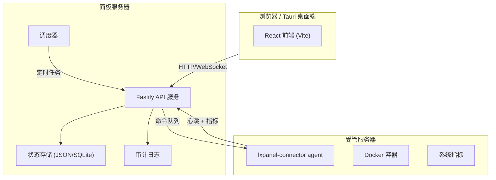

# 架构概览

## 系统架构

## 核心模块

| 模块 | 职责 |
|------|------|
| `apps/api` | Fastify HTTP 服务，提供 REST API 和静态文件托管 |
| `apps/web` | React 前端工作台 |
| `apps/desktop-tauri` | Tauri 桌面托盘客户端 |
| `packages/shared` | 前后端共享的类型定义 |
| `scripts/lxpanel-connector.mjs` | 受管服务器上的轻量 agent |

## 数据流

1. 用户通过浏览器或桌面客户端访问面板。
2. API 服务处理请求，读写状态存储和审计日志。
3. 连接器 agent 定期心跳上报指标、领取命令。
4. 调度器在后台执行计划任务（备份、归档、告警检查）。
