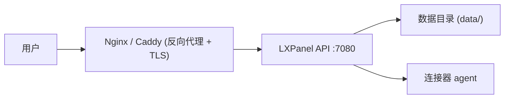

# 部署指南

## 生产拓补



## 环境变量

| 变量 | 默认值 | 说明 |
|------|--------|------|
| `LXPANEL_HOST` | `127.0.0.1` | 监听地址 |
| `LXPANEL_PORT` | `7080` | 监听端口 |
| `LXPANEL_DATA_DIR` | `./data` | 数据目录 |
| `LXPANEL_STATE_STORE` | `json` | 状态存储: json / sqlite |
| `LXPANEL_SESSION_SECRET` | 开发默认值 | **生产环境必须设置强随机值** |
| `LXPANEL_COOKIE_SECURE` | `false` | HTTPS 时设为 `true` |

## Docker Compose

```yaml
version: "3"
services:
  lxpanel:
    image: lxpanel/server:latest
    ports:
      - "7080:7080"
    volumes:
      - ./data:/app/data
    environment:
      - LXPANEL_SESSION_SECRET=your-strong-secret
      - LXPANEL_COOKIE_SECURE=true
```

## 反向代理

详见 `docs/deployment.md`。
